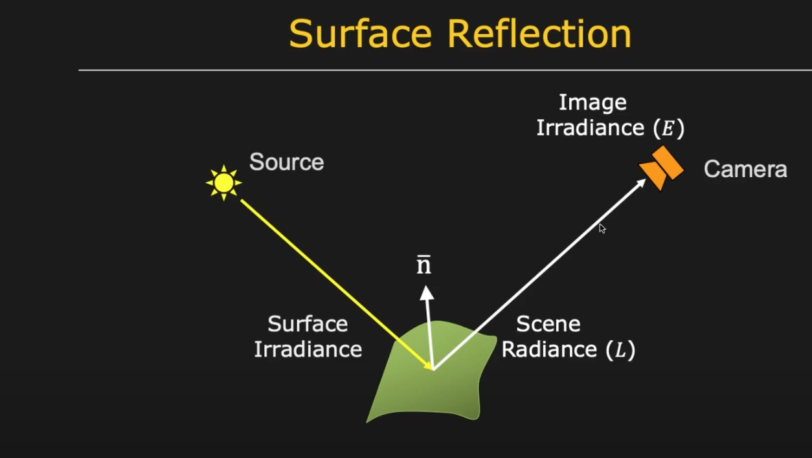
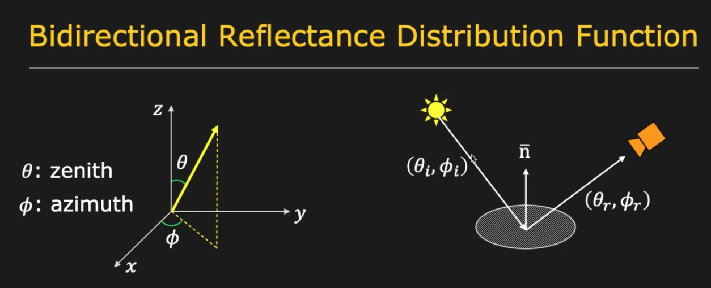

## BRDF: Bi-directional Reflectance Distribution Function

The reflectance property of a material in a scene.

**Bi-direction:** 
- where the light comes from, illumination direction 
- where the light is been reflected and observed, reflection direction

Represent the incoming ray and outgoing ray in terms of theta and phi.

