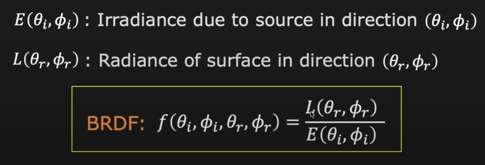
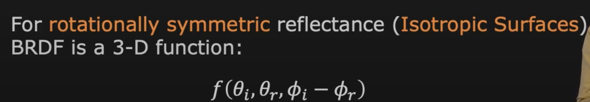

## BRDF: Bi-directional Reflectance Distribution Function

The reflectance property of a material in a scene.
https://www.youtube.com/watch?v=R9iZzaXUaK4

**Bi-direction:** 
- where the light comes from, illumination direction 
- where the light is been reflected and observed, reflection direction

Represent the incoming ray and outgoing ray in terms of theta and phi.

Irradiance: the amount of light energy from one thing hitting a square meter of another each second

Helmhortz property: 
- Flip the incoming ray and outgoing ray, still same property of BRDF
- Not exactly the same brightness seen from observer, just to say that the ability of the surface(material) is the same.

Isotropic surface: 
- When the camera move around the surface, the brightness of the point we focus on remains the same.
- BRDF function only requires 3 inputs.

